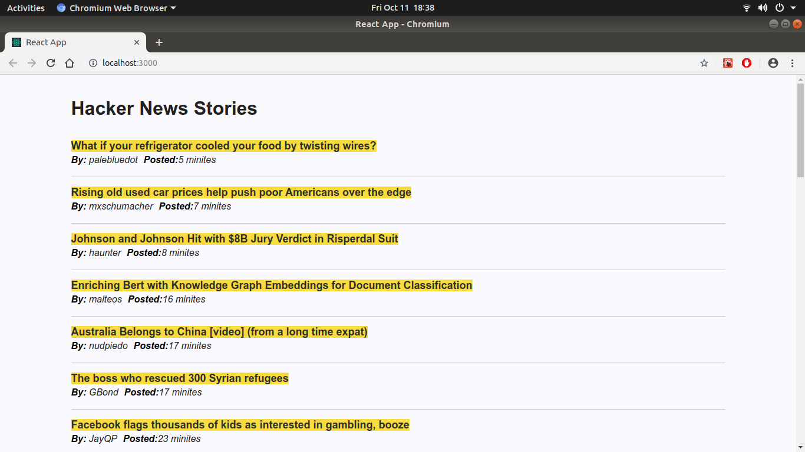

## News-reader Web App [DEMO](https://hackernews24.netlify.com/)

# Technologies used:

- HackerNews Api
- React
- React Testing Library
- Styled Components
- Axios
- Memo
- Nodejs
- javaScrip

## Available Scripts

In the project directory, you can run:

### `yarn start`

### `yarn test`

Runs the app in the development mode. 
Open [http://localhost:3000](http://localhost:3000) to view it in the browser.

### `yarn build`

Builds the app for production to the `build` folder. 
It correctly bundles React in production mode and optimizes the build for the best performance.
